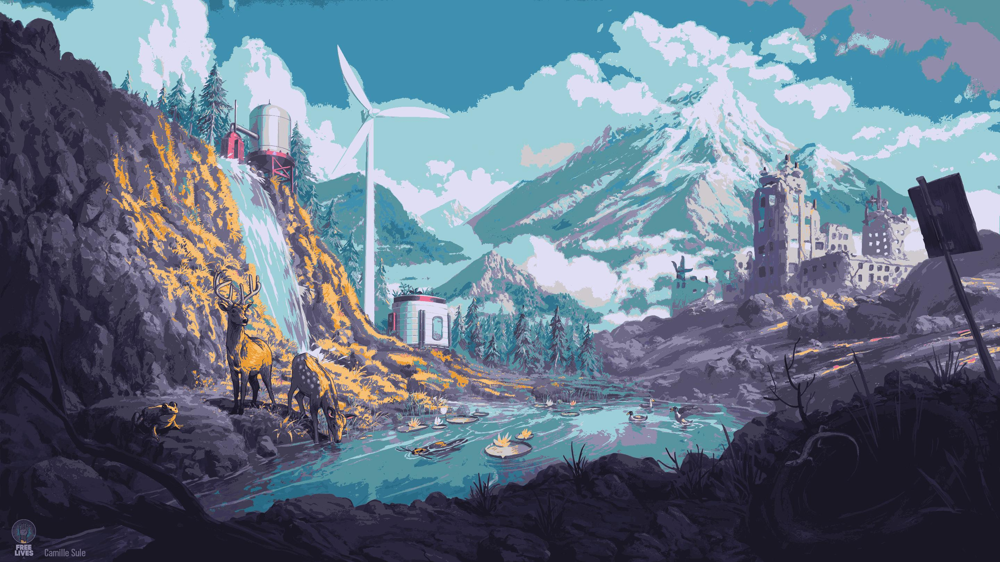
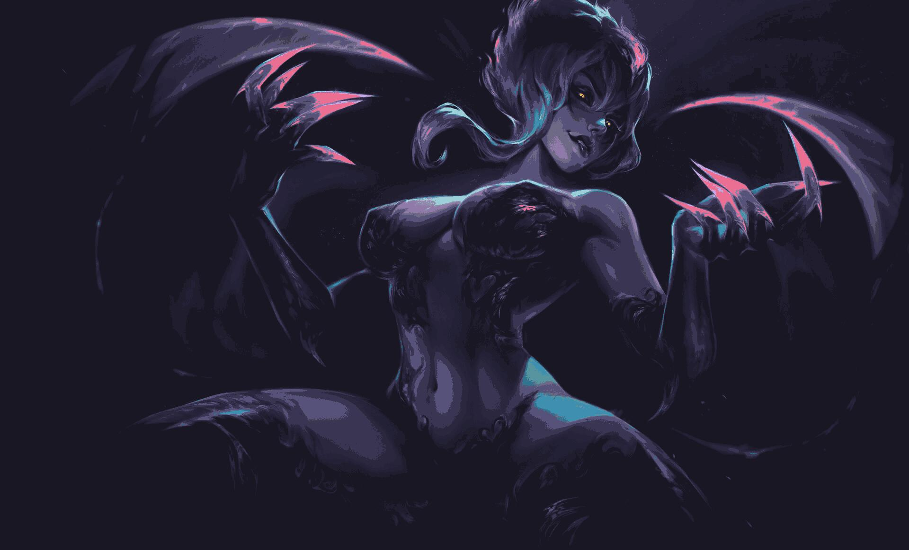

# Rosepine Wallpapers

My collection of wallpapers with [Rosepine](https://rosepinetheme.com) colorscheme.

 **⚠️ CAUTION: NSFW included.**

## Preview
**After the apocalypse**

**Into the abyss**

**Leage of Legends**

**Beauty of all**

**Succubus**

**Dragon Lake**

**Fantasy Road**

**Hell Taker**

**New Step**

**Cairo**

**Cyberpunk Girl**

**Devil Girl**

**Fantasy Island**

**Egyptian Cat**

**Elf Adventure**

**Evelynn LoL**


## How to Download

Run the command below to clone this repository and copy its contents to `~/Pictures/wal` (directory will be created if it doesn't exist):

```bash
mkdir -p ~/Pictures/wal && git clone https://github.com/zedxot/rosepine-walls.git /tmp/rosepine-walls && cp -r /tmp/rosepine-walls/* ~/Pictures/wal/ && rm -rf /tmp/rosepine-walls
```
## Credits

- [Rosepine](https://rosepinetheme.com): Beautiful color scheme that powers these wallpapers.
- [Gowall](https://github.com/Achno/gowall): Tool used to dynamically recolor wallpapers.
